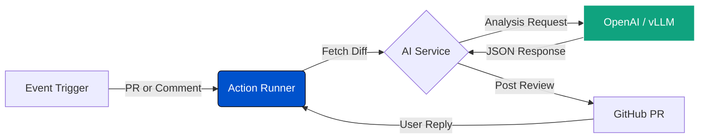

<div align="center">
  <h1>Qlux Code Reviewer</h1>
  <p>
    <strong>Automated Code Analysis.</strong> <br>
    AI-powered code reviews integrated directly into your GitHub Pull Requests.
  </p>

  <!-- Badges -->
  <a href="https://github.com/marketplace/actions/qlux-code-reviewer">
    
  </a>
  <a href="LICENSE">
    
  </a>
  <a href="#">
    
  </a>
</div>

<br />

<div align="center">
  
</div>

---

## Quick Start

Create a workflow file `.github/workflows/ai-review.yml` in your repository.

```yaml
name: AI Review

permissions:
  contents: read
  pull-requests: write
  issues: write

on:
  pull_request:
    types: [opened, synchronize]
  issue_comment:
    types: [created]

jobs:
  review:
    runs-on: ubuntu-latest
    steps:
      - uses: actions/checkout@v4
      - name: AI Code Reviewer
        uses: QluxLab/Reviewer@v1.0.0
        with:
          openai_api_key: ${{ secrets.OPENAI_API_KEY }}
          github_token: ${{ secrets.GITHUB_TOKEN }}
          # Optional:
          # model: 'gpt-4o'
          # ignore_patterns: 'package-lock.json, *.svg'
```

---

## Workflow Logic

Qlux Code Reviewer acts as an intelligent agent within your development lifecycle. It analyzes diffs, maintains context, and manages its own comments.



---

## Features

| Feature | Description |
| :--- | :--- |
| **Multi-Trigger Support** | Runs on new/updated Pull Requests, manual `/review` comments, or user replies. |
| **Smart Maintenance** | Automatically cleans up outdated comments on new commits and prevents duplicate reviews. |
| **Detailed Output** | Provides a high-level summary and inline code comments with specific severity levels. |
| **Interactive Mode** | Responds to user replies on inline comments with context-aware explanations. |
| **Configurable** | customizable system prompts, ignore patterns, and severity filtering. |
| **Model Agnostic** | Compatible with OpenAI, Azure, vLLM, Ollama, and other OpenAI-compatible APIs. |

---

## Usage Guide

### Manual Trigger
To trigger a review manually or with specific instructions, comment on the PR.

**Standard Trigger**
```text
/review
```

**Custom Instructions**
```text
/review Focus on security vulnerabilities and performance optimizations.
```

### Interactive Reviews
Users can reply to AI-generated comments. The system detects the reply, reads the conversation thread, and provides a contextual response.

### Configuration Options
*   **Severity Filtering**: Use `min_severity` to filter comments (low, medium, high, critical).
*   **Inline Comments**: Disable inline comments with `disable_inline: true`.
*   **File Filtering**: Customize ignored files using `ignore_patterns`.

---

## Inputs

| Input | Description | Required | Default |
| :--- | :--- | :---: | :--- |
| `openai_api_key` | API Key for OpenAI or compatible service. | Yes | N/A |
| `github_token` | GitHub Token (`${{ secrets.GITHUB_TOKEN }}`). | Yes | N/A |
| `model` | Model ID to use. | No | `gpt-4o` |
| `openai_base_url` | Base URL for the API. | No | `https://api.openai.com/v1` |
| `system_message` | Custom system prompt for the AI. | No | *Default Reviewer Prompt* |
| `ignore_patterns` | Comma-separated glob patterns to ignore. | No | `package-lock.json,yarn.lock...` |
| `min_severity` | Minimum severity level for comments. | No | `low` |
| `disable_inline` | Disable inline comments generation. | No | `false` |

---

## Development

The project follows a service-oriented architecture.

*   **`src/main.ts`**: Main orchestrator handling GitHub events.
*   **`src/services/github.ts`**: GitHub API interactions and PR management.
*   **`src/services/ai.ts`**: AI service for code review generation.
*   **`src/config.ts`**: Runtime configuration management.
*   **`src/utils.ts`**: Helper functions for parsing and filtering.

**Build and Run**
1.  Install dependencies: `npm install`
2.  Build the action: `npm run build`
3.  Artifact location: `dist/index.js`

---

<div align="center">
  <p>Maintained by QluxLab</p>
</div>
