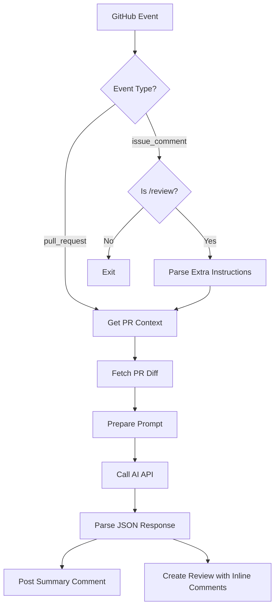

# AI Code Reviewer GitHub Action - Architecture Plan

## Overview
A reusable GitHub Action that performs AI-powered code reviews on Pull Requests. It supports triggering via PR events (open/synchronize) and manual triggers via `/review` comments. It interacts with any OpenAI-compatible API to generate summaries and inline code comments.

## Core Features
1.  **Dual Trigger Support**:
    *   `pull_request`: Runs on new PRs or updates.
    *   `issue_comment`: Runs when a user comments `/review [extra instructions]`.
2.  **OpenAI-Compatible**: Works with OpenAI, Azure OpenAI, local models (via Ollama/vLLM), etc.
3.  **Output**:
    *   Top-level PR summary.
    *   Inline code review comments.
4.  **Customization**: Custom system prompts and per-run instructions via comment.

## Architecture Components

### 1. Entry Point (`src/main.ts`)
*   Orchestrates the flow.
*   Initializes services.
*   Handles top-level error catching.

### 2. Configuration (`src/config.ts`)
*   Uses `@actions/core` to read inputs.
*   **Inputs**:
    *   `openai_token`: API Key.
    *   `openai_base_url`: Base URL (default: `https://api.openai.com/v1`).
    *   `model`: Model name (default: `gpt-4o`).
    *   `github_token`: `GITHUB_TOKEN` for API access.
    *   `system_message`: Base instructions for the AI.
    *   `ignore_patterns`: Glob patterns to ignore files (e.g., `package-lock.json`).

### 3. specific Event Handler (`src/event-handler.ts`)
*   Determines if the run should proceed.
*   **Logic**:
    *   If `pull_request`: Extract PR number.
    *   If `issue_comment`:
        *   Check if comment body starts with `/review`.
        *   If yes, extract "extra instructions" from the rest of the comment.
        *   Fetch the PR object associated with the issue (issues and PRs share IDs, but we need to ensure it's a PR).
    *   Else: Skip.

### 4. GitHub Service (`src/services/github.ts`)
*   Wrapper around `@actions/github` (Octokit).
*   **Methods**:
    *   `getPullRequestDiff(prNumber)`: Fetches the raw diff string.
    *   `postComment(prNumber, body)`: Posts the general summary.
    *   `postReview(prNumber, comments)`: Posts inline comments using `createReview` endpoint.
    *   `getChangedFiles(prNumber)`: Helper to filter ignored files before fetching full diff (optimization).

### 5. AI Service (`src/services/ai.ts`)
*   Wrapper around `openai` npm package.
*   **Prompt Strategy**:
    *   System Prompt: "You are an expert code reviewer..."
    *   User Prompt: "Review the following git diff. Respond in JSON format."
    *   JSON Schema:
        ```json
        {
          "summary": "Markdown summary of changes...",
          "comments": [
            {
              "file": "path/to/file.ts",
              "line": 42,
              "body": "Comment content..."
            }
          ]
        }
        ```
*   **Context Management**: Handles large diffs (simple truncation or file-by-file strategy if needed, initially simple truncation).

### 6. Diff Parser (`src/utils/diff.ts`)
*   (Optional but recommended) Parse the diff to map "hunks" to line numbers to ensure inline comments land on the correct lines in the PR. *Note: GitHub API requires position or line in the new file.*

## Data Flow Diagram



## Project Structure

```
.
├── action.yml          # Action metadata
├── package.json
├── tsconfig.json
├── src
│   ├── main.ts         # Entry point
│   ├── config.ts       # Input parsing
│   ├── services
│   │   ├── github.ts   # Octokit interactions
│   │   └── ai.ts       # OpenAI interactions
│   └── utils
│       └── diff.ts     # Diff parsing helpers
└── dist/               # Compiled bundle (via ncc)
```

## Implementation Plan (Phase 1)
1.  Setup TypeScript project & build pipeline (`@vercel/ncc`).
2.  Implement `action.yml` interface.
3.  Implement `GitHubService` to fetch diffs and post comments.
4.  Implement `AIService` with JSON mode enforcement.
5.  Wire logic in `main.ts` to handle both event types.